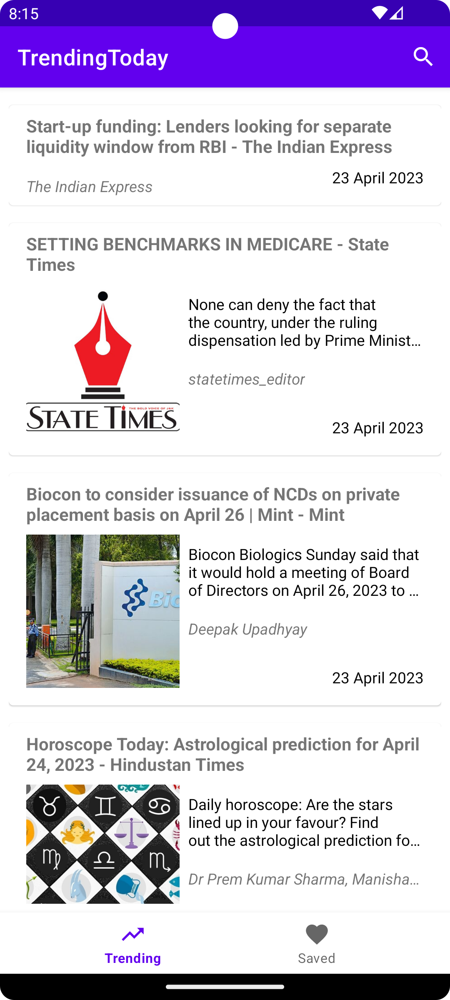
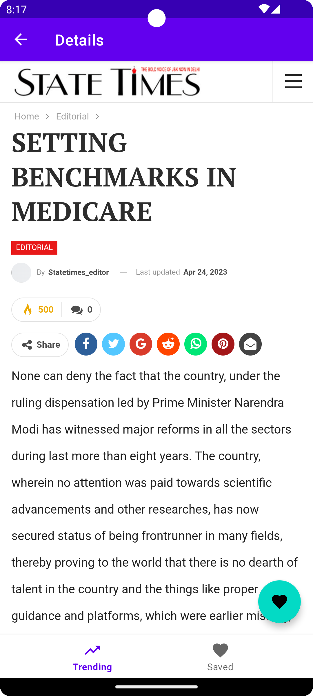
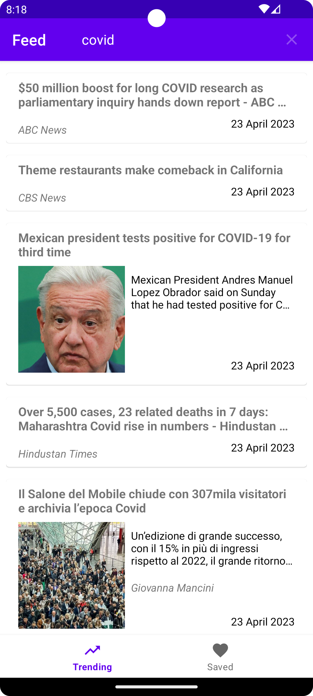

## TrendingToday

#### A native Android app built using Kotlin + Clean Architecture + Jetpack Libraries. Scrolling through a curated list of the trending news in a particular country, saving your favourite news article to read later and searching through over 80K+ news articles from different sources are some of the app's primary features. The app uses the popular news.org free API to download news articles.

---

`Note:
To build the app, create variables in the gradle.properties file API_KEY and BASE_URL and place appropriate values.
`

---

### Libraries Used:
* ViewModel + LiveData
* Room
* Navigation
* Retrofit
* Gson
* Coroutines
* Hilt
* Glide
* JUnit
* MockWebServer
* Truth

---

### Screenshots:
| Feed | Article WebView | Saved Articles | Demo |
|---|---|---|---|
|  |  |  | 
